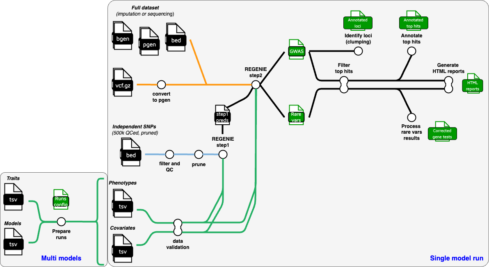

# nf-pipeline-regenie

A nextflow pipeline to perform genome-wide association studies (GWAS) and rare variant association analysis using [regenie](https://github.com/rgcgithub/regenie) at high speed.



## Main features:

- The pipeline is optimized for massive scaling, by chunking operations as much as possible. When computational resources are available, you can cut down run time by increasing the limit on concurrent tasks.
- All major data types are accepted as input, including plink1 binary dataset (bed/bim/fam), plink2 binary dataset (pgen/pvar/psam), bgen format (bgen/bgi/sample), and vcf.gz format.
- The pipeline can perform both standard GWAS analysis on single variants, and aggregated rare variant tests using burden test and any of the tests available in regenie, namely skat, skato, sakto-acat, acatv, acato, acato-full.
- Results include summary statistics, but also filtered tophits / loci annotated with nearby genes and an HTML report for each phenotype with Manhattan plot and regional plots for the best loci.
- Two running modes are available: **single project mode** and **multi models mode**. Using the multi models mode it is possible fully automate the test of multiple association models for a cohort. You just need to provide a trait table with phenotype and covariates and a model table containing all the desired combinations of models. The pipeline will take care of setting up uniform analysis groups.

## How to use

The suggested way to run the pipeline is to create a config file defining your computations environment and a config file for your project. You can use the templates provided in the `templates` folder.

Then you can invoke the pipeline using `nextflow run HTGenomeAnalysisUnit/nf-pipeline-regenie -profile singularity,myprofile -c your_project.conf -c your_profile.conf`

## Quick Start

1. Create a folder for your project (e.g. `yourproject`) 

2. Prepare a tab-separated table of phenotypes and eventually covariates (see the [input section](input-phenotype-file.md)).

3. Prepare and configure the required [input data for step 2](input-full-data.md), usually an imputed or sequencing dataset, and [step 1](input-indep-snps.md), usually a QCed and pruned dataset. You can eventually prepare also a [set of files for LD computation](input-ld-panel.md), suggested when analyzing a large dataset with > 100k samples.

4. If you want to perform a multi-models execution, prepare the [models table](input-models-table.md) to describe your analyses.

5. Prepare the necessary config files, using the templates provided in the `templates` folder:
   1. A [config file](main-parameters.md) describing settings and inputs for your project 
   2. A config file to [define the profile](hpc-profile.md) for your computational environment. 
   3. Optionally, you can also add configuration to enable execution monitoring using [Nextflow Tower](tower-monitoring.md)

6. Invoke the pipeline using `nextflow run HTGenomeAnalysisUnit/nf-pipeline-regenie`

Usually, you want to prepare a script to submit the pipeline in your project folder. In this example we use `sbatch` submission system, but this can be adapted to any scheduler. `myprofile` corresponds to a profile you created for your computational environment:

```bash
#!/bin/bash
#SBATCH --job-name nf-regenie
#SBATCH --output nf-regenie_master_%A.log
#SBATCH --partition cpuq
#SBATCH --cpus-per-task 1
#SBATCH --mem 8G
#SBATCH --time 1-00:00:00

module load nextflow/22.10.1 singularity/3.8.5

export NXF_OPTS="-Xms1G -Xmx8G" 
nextflow run HTGenomeAnalysisUnit/nf-pipeline-regenie \
   -profile singularity,myprofile -c your_project.conf
```

Alternatively, you can clone the latest pipeline version using

`git clone --depth 1 https://github.com/HTGenomeAnalysisUnit/nf-pipeline-regenie.git`

This will create a new folder called `nf-pipeline-regenie` in the current folder containing all the pipeline files.

You can eventually chose a specific version of the pipeline using the `--branch` option

`git clone --depth 1 --branch v1.8 https://github.com/HTGenomeAnalysisUnit/nf-pipeline-regenie.git`


## Documentation

Complete documentation is available in [GitHub pages](https://htgenomeanalysisunit.github.io/nf-pipeline-regenie/)

## Credits

The original concept is based on this amazing [github repository](https://github.com/genepi/nf-gwas) from Institute of Genetic Epidemiology, Innsbruck maintained by Sebastian Schönherr and Lukas Forer.

## License

nf-highspeed-gwas is MIT Licensed.

## Contact

- [Edoardo Giacopuzzi](mailto:edoardo.giacopuzzi@fht.org)
