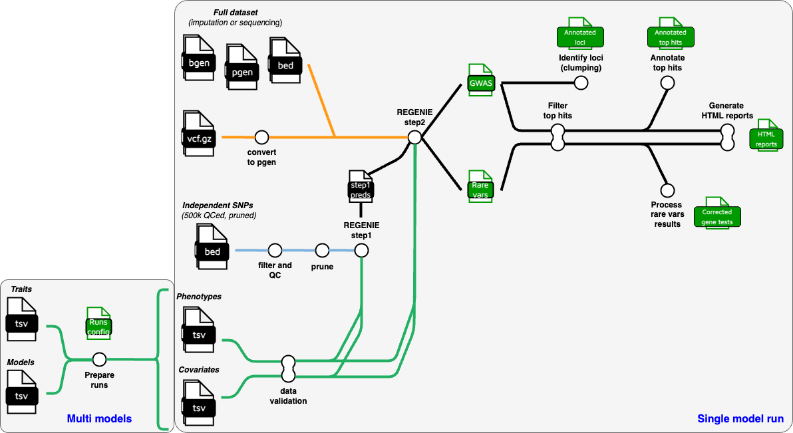

# nf-pipeline-regenie

A nextflow pipeline to perform genome-wide association studies (GWAS) and rare variant association analysis using [regenie](https://github.com/rgcgithub/regenie) at high speed.

Main features:

- The pipeline is optimized for massive scaling, by chunking operations as much as possible. When computational resources are available, you can cut down run time by increasing the limit on concurrent tasks (see the [adjust parallelization section](parallelization.md)).
- All major data types are accepted as input, including plink1 binary dataset (bed/bim/fam), plink2 binary dataset (pgen/pvar/psam), bgen format (bgen/bgi/sample), and vcf.gz format.
- The pipeline can perform both standard GWAS analysis on single variants, and aggregated rare variant tests using burden test and any of the tests available in regenie, namely skat, skato, sakto-acat, acatv, acato, acato-full.
- Results include summary statistics, but also filtered tophits and loci annotaed with neary genes and an HTML report for each phenotype with Manhattan plot and regional plots for the best loci.
- Two running modes are available: [**single project mode**](single-model.md) and [**multi models mode**](multi-models.md). Using the multi models mode it is possible fully automate the test of multiple association models for a cohort. You just need to provide a trait table with phenotype and covariates and a model table containing all the desired combinations of models. The pipeline will take care of settin up uniform analysis groups.

The original concept is based on this amazing [github repository](https://github.com/genepi/nf-gwas) from Institute of Genetic Epidemiology, Innsbruck maintained by Sebastian Schönherr and Lukas Forer.
